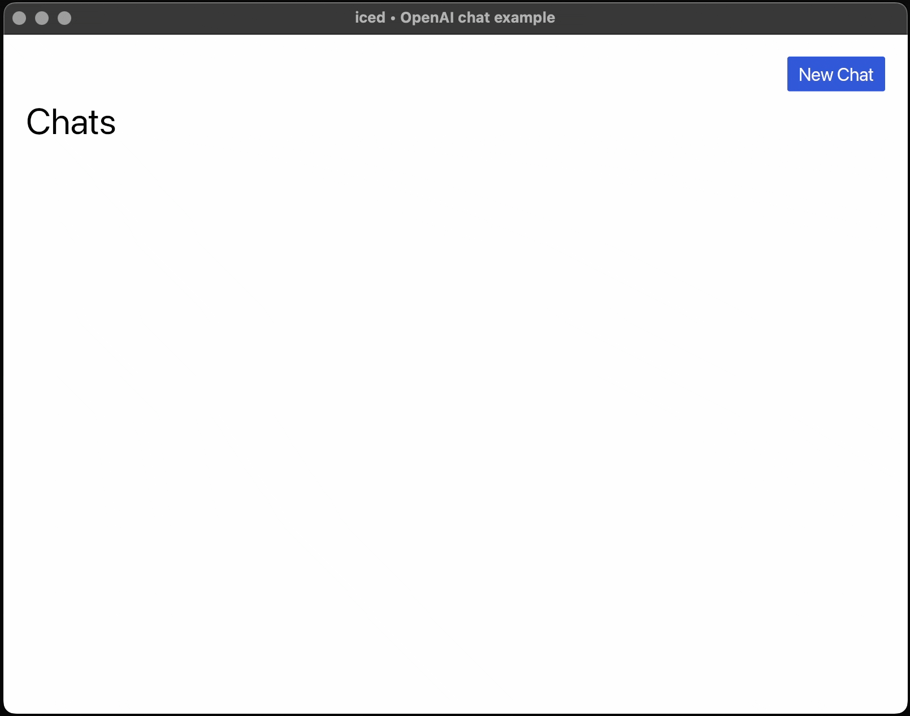

<div align="center">

# iced_openai

A simple chat application built with [iced](https://github.com/iced-rs/iced) and
[async_openai](https://github.com/64bit/async-openai) demonstrating how to
create multi-screen desktop applications with asynchronous operations. In this
particular case, the application allows you to chat with an OpenAI assistant
using your provided API key.

[](https://github.com/iced-rs/iced)



</div>

## Overview

This example showcases a few useful concepts for building desktop applications with `iced`:

- Multiple screen management (chat list and individual chats)
- Asynchronous requests to a remote API (OpenAI)
- Message history tracking and display
- Markdown rendering

It could easily be adapted to other use cases, such as a chat client for actual
messaging between users, a note-taking application with markdown support, a
task manager, etc.

## Prerequisites

You'll need to create a `.env` file in the project root with your OpenAI API key:

```
OPENAI_KEY=your-api-key-here
```

## Project Structure

```
src/
├── main.rs        # App entry point and top-level state
├── assistant.rs   # OpenAI API integration
├── chat.rs        # Chat screen UI and logic
├── list.rs        # Chat list screen UI and logic
└── error.rs       # Error handling utilities
```

## Running the Application is as easy as:

```bash
cargo run
```

## Future Improvements

Some basic features that come to mind for future iterations of this project:
- [ ] Chat deletion
- [ ] Custom chat titles
- [ ] Copy and paste messages
- [ ] Copy and paste codeblocks
- [ ] Edit previous messages (threads)
- [ ] Persistent storage of chat history
- [ ] Automatic .env file creation
- [ ] Response streaming
- [ ] Extended OpenAI API usage (model selection, temperature, etc.)
- [ ] OpenAI assistants API
- [ ] Custom endpoint for alternative chatbots with OpenAI-compatible APIs
- [ ] File attachments
- [ ] Chat export

## Acknowledgements

- [iced](https://github.com/iced-rs/iced)
- [async-openai](https://github.com/64bit/async-openai) 

## License

This project is licensed under the MIT License - see the [LICENSE](LICENSE) file for details.

## Contributing

This is an example project meant for learning purposes, but if you have suggestions for improvements or bug fixes, feel free to open an issue or submit a pull request.